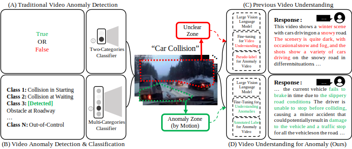

<div align="center">

# [NeurIPS 2024] Hawk: Learning to Understand Open-World Video Anomalies

<div align="center">

### This is the official repository for [Hawk](https://arxiv.org/pdf/2405.16886).

[Jiaqi Tang](https://jqt.me/)^, [Hao Lu](https://scholar.google.com/citations?user=OOagpAcAAAAJ&hl=en)^, [Ruizheng Wu](https://scholar.google.com/citations?user=OOagpAcAAAAJ&hl=en), [Xiaogang Xu](https://xuxiaogang.com/), [Ke Ma](https://scholar.google.com.hk/citations?user=yXGNGS8AAAAJ&hl=en), [Cheng Fang](), 

[Bin Guo](http://www.guob.org/), [Jiangbo Lu](https://sites.google.com/site/jiangbolu), [Qifeng Chen](https://cqf.io/) and [Ying-Cong Chen](https://www.yingcong.me/)*

^: Equal contribution.
*: Corresponding Author.

[](https://github.com/jqtangust/hawk/blob/master/LICENSE) [](https://code.visualstudio.com/) [](https://badges.strrl.dev)


</div>
</div>

## 🔍 **Motivation** - Have eyes like a Hawk!
- 🚩 Current VAD systems are often limited by their superficial semantic understanding of scenes and minimal user interaction. 
- 🚩 Additionally, the prevalent data scarcity in existing datasets restricts their applicability in open-world scenarios.

  <div align="center">
    
  </div>


## 📢 **Updates**

- ✅ Step 26, 2024 - **Hawk** is accepted by NeurIPS 2024.
- ✅ July 29, 2024 - We release the **dataset** of Hawk. Check this Google Cloud link for [DOWNLOAD](https://drive.google.com/file/d/1WCnizldWZvtS4Yg5SX7ay5C3kUQfz-Eg/view?usp=sharing).


## ▶️ **Getting Started**

<!-- 1. [Installation](#installation)
2. [Dataset](#dataset)
3. [Configuration](#configuration)
5. [Testing](#Testing)
4. [Training](#Training) -->

### 🪒 *Installation*
<!-- - *Python >= 3.8.2*
- *PyTorch >= 1.8.1*
- *Install [Polanalyser](https://github.com/elerac/polanalyser) for processing polarization image*
    ```
    pip install git+https://github.com/elerac/polanalyser
    ```
- *Install other dependencies by*
    ```
    pip install -r requirements.txt
    ``` -->


### 💾 *Dataset Preparation*

- DOWNLOAD all video datasets for their original sources.
  1. [CUHK_Avenue](https://www.cse.cuhk.edu.hk/leojia/projects/detectabnormal/dataset.html)
  2. [DoTA](https://github.com/MoonBlvd/Detection-of-Traffic-Anomaly)
  3. [Ped1](http://www.svcl.ucsd.edu/projects/anomaly/dataset.htm)
  4. [Ped2](http://www.svcl.ucsd.edu/projects/anomaly/dataset.htm)
  5. [ShanghaiTech](https://svip-lab.github.io/dataset/campus_dataset.html)
  6. [UBNormal](https://github.com/lilygeorgescu/UBnormal/)
  7. [UCF_Crime](https://www.crcv.ucf.edu/projects/real-world/)

- Google Drive Link to [DOWNLOAD](https://drive.google.com/file/d/1WCnizldWZvtS4Yg5SX7ay5C3kUQfz-Eg/view?usp=sharing) our annotations.

- Data Structure: each folder contains one annotation file (e.g. CUHK Avenue, DoTA, etc.). The `All_Mix` directory contains all of the datasets in training and testing.
- The dataset is organized as follows:

    ```
    data
    ├── All_Mix
    │   ├── all_videos_all.json
    │   ├── all_videos_test.json
    │   └── all_videos_train.json
    │    
    ├── CUHK_Avenue
    │   └── Avenue.json
    ├── DoTA
    │   └── DoTA.json
    ├── Ped1
    │   ├── ...
    ├── ...
    └── UCF_Crime
        └── ...
    ```
    Note：the data path should be redefined.

### 🏰 *Pretrained Model*
<!-- - Google Drive Link for downloading our [Pretrained Model](https://drive.google.com/file/d/13Cn7tX5bFBxsYZG1Haw5VcqhSxWnNzMW/view?usp=sharing) in K-Ford. -->

### 🔨 *Configuration*
<!-- 
- The configuration files for [`testing`](FilmRemoval/codes/options/test/test.yml) and [`training`](FilmRemoval/codes/options/train/train.yml).

- The Test_K_ford option specifies the number of folds for K-fold cross-validation during testing. The data root option specifies the root directory for the dataset, which is set to Dataset. Other configuration settings include learning rate schemes, loss functions, and logger options.

  ```
  datasets:
    train:
      name: Reconstruction
      mode: LQGT_condition
      Test_K_ford: K10 # remove from training
      dataroot: /remote-home/share/jiaqi2/Dataset
      dataroot_ratio: ./
      use_shuffle: true
      n_workers: 0
      batch_size: 1
      GT_size: 0
      use_flip: true
      use_rot: true
      condition: image
    val:
      name: Reconstruction
      mode: LQGT_condition_Val
      Test_K_ford: K10 # for testing
      dataroot: /remote-home/share/jiaqi2/Dataset
      dataroot_ratio: ./
      condition: image
  ``` -->

### ⏳ *Testing*
<!-- 
- Modify `dataroot`, `Test_K_ford` and `pretrain_model_G` in [`testing`](FilmRemoval/codes/options/train/test.yml) configuration, then run
  ```
  python test.py -opt ./codes/options/test/test.yml
  ```
- The test results will be saved to `./results/testset_name`, including `Restored Image` and `Prior`.  -->

### 🖥️ *Training*
<!-- 

- Modify `dataroot` and `Test_K_ford` in [`training`](FilmRemoval/codes/options/train/train.yml) configuration, then run
  ```
  python train.py -opt ./codes/options/train/train.yml
  ```
- The logs, models and training states will be saved to `./experiments/name`. You can also use `tensorboard` for monitoring for the `./tb_logger/name`.

- Restart Training (To add checkpoint in [`training`](FilmRemoval/codes/options/train/train.yml) configuration)
  ```
  path:
    root: ./
    pretrain_model_G: .../experiments/K1/models/XX.pth
    strict_load: false
    resume_state: .../experiments/K1/training_state/XX.state
  ``` -->


## ⚡ **Performance**
<!-- Compared with other baselines, our model achieves state-of-the-art performance:

> ⭐ **[Table 1] Quantitative evaluation in image reconstruction with 10-fold cross-validation.**
> | Methods | PSNR | SSIM |
> |---------|------|------|
> | SHIQ| 21.58 | 0.7499 |
> | Polar-HR| 22.19 | 0.7176 |
> | Uformer| 31.68 | 0.9426 |
> | Restormer| 34.32 | 0.9731 |
> | Ours| 36.48 | 0.9824 |

> ⭐ **[Figure 1] Qualitative Evaluation in image reconstruction.**
> 

> ⭐ **[Figure 2-3] Qualitative Evaluation in Industrial Environment. (QR Reading & Text OCR)**
>  -->

## 🌐 **Citations**

**The following is a BibTeX reference:**

``` latex
@misc{tang2024hawk,
      title={Hawk: Learning to Understand Open-World Video Anomalies}, 
      author={Jiaqi Tang and Hao Lu and Ruizheng Wu and Xiaogang Xu and Ke Ma and Cheng Fang and Bin Guo and Jiangbo Lu and Qifeng Chen and Ying-Cong Chen},
      year={2024},
      eprint={2405.16886},
      archivePrefix={arXiv},
      primaryClass={cs.CV},
      url={https://arxiv.org/abs/2405.16886}, 
}
```

## 📧 **Connecting with Us?**

If you have any questions, please feel free to send email to `jtang092@connect.hkust-gz.edu.cn`.


<!-- ## 📜 **Acknowledgment**
This work is supported by the National Natural Science Foundation of China (No. 62206068) and the Natural Science Foundation of Zhejiang Province, China under No. LD24F020002. -->
