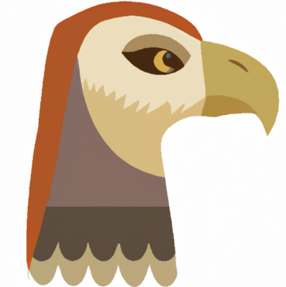
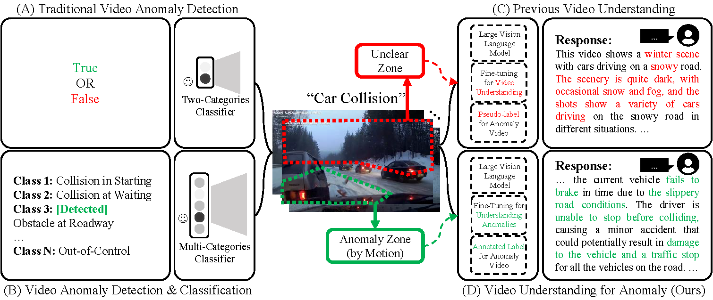
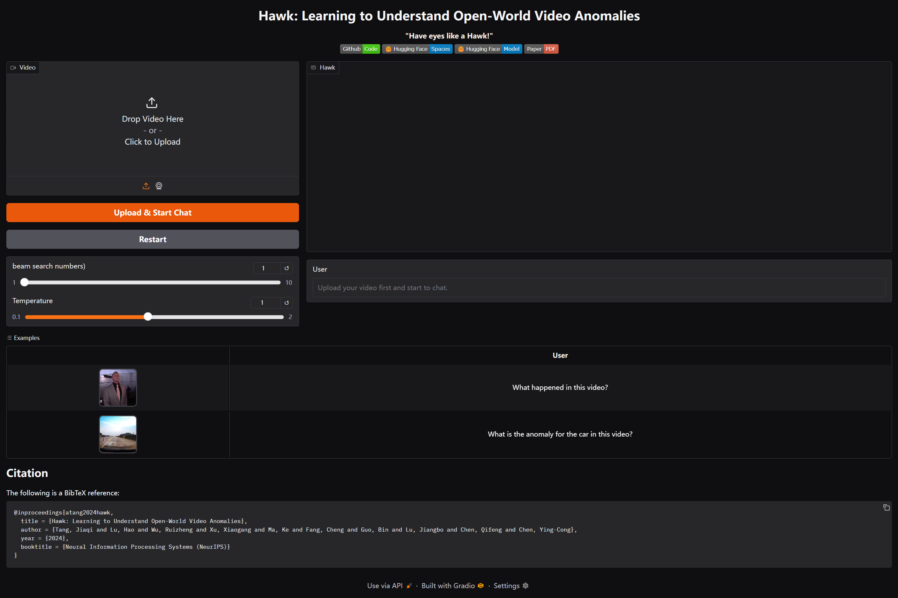

<div align="center">

# [NeurIPS 2024] Hawk: Learning to Understand Open-World Video Anomalies

<div align="center">

### This is the official repository for [Hawk](https://openreview.net/pdf?id=vBKoEZ1PG3).

[Jiaqi Tang^](https://jqt.me/), [Hao Lu^](https://scholar.google.com/citations?user=OOagpAcAAAAJ&hl=en), [Ruizheng Wu](https://scholar.google.com/citations?user=OOagpAcAAAAJ&hl=en), [Xiaogang Xu](https://xuxiaogang.com/), [Ke Ma](https://scholar.google.com.hk/citations?user=yXGNGS8AAAAJ&hl=en), [Cheng Fang](), 
\
[Bin Guo](http://www.guob.org/), [Jiangbo Lu](https://sites.google.com/site/jiangbolu), [Qifeng Chen](https://cqf.io/) and [Ying-Cong Chen*](https://www.yingcong.me/)

^: Equal contribution.
*: Corresponding Author.

[](https://code.visualstudio.com/) [](https://badges.strrl.dev)



</div>
</div>


## 📢 **Updates**

- ✅ Feb 25, 2025 - Huggingface Demo of **Hawk** is avaliable at [HERE](https://huggingface.co/spaces/Jiaqi-hkust/hawk).
- ✅ Feb 25, 2025 - We release the **training and demo code** of **Hawk**.
- ✅ Feb 25, 2025 - We release the **dataset (video + annotation)** of **Hawk**. Check this Huggingface link for [DOWNLOAD](https://huggingface.co/datasets/Jiaqi-hkust/hawk).
- ✅ Step 26, 2024 - **Hawk** is accepted by NeurIPS 2024.
- ✅ June 29, 2024 - We release the **dataset (annotation)** of Hawk. Check this Google Cloud link for [DOWNLOAD](https://drive.google.com/file/d/1WCnizldWZvtS4Yg5SX7ay5C3kUQfz-Eg/view?usp=sharing).


## 🔍 **Motivation** - Have eyes like a Hawk!
- 🚩 Current VAD systems are often limited by their superficial semantic understanding of scenes and minimal user interaction. 
- 🚩 Additionally, the prevalent data scarcity in existing datasets restricts their applicability in open-world scenarios.

  <div align="center">
    
  </div>


## ▶️ **Getting Started**

### 🪒 *Installation*
- Create environment by following steps:
  ```
  apt install ffmpeg
  conda env create -f environment.yml
  conda activate hawk
  ```

### 🏰 *Pretrained and Fine-tuned Model*


- The following checkpoints are utilized to run Hawk：

  | Checkpoint       | Link | Note |
  |:------------------|-------------|-------------|
  | Video-LLaMA-2-7B-Finetuned | [link](https://huggingface.co/DAMO-NLP-SG/Video-LLaMA-2-7B-Finetuned/tree/main) | Used as initial weights for training.|
  | **Hawk_Pretrained** | [link](https://huggingface.co/Jiaqi-hkust/hawk) | Pretrained on the [WebViD](https://github.com/m-bain/webvid)|
  | **Hawk_Finetuned** | [link](https://huggingface.co/Jiaqi-hkust/hawk) | Fine-tuned on [Hawk dataset](https://huggingface.co/datasets/Jiaqi-hkust/hawk)|

- If you want to use the pretrained model, please use the **Hawk_Pretrained** checkpoint. 
- If you wish to leverage the model for our anomaly understanding, please opt for the **Hawk_Finetuned** checkpoint.


## ⏳ **Domo**

- The configuration files for [`demo`](/configs/eval_configs/eval.yaml).

- Replace the following part as your own path:
  ```
    # Use LLaMA-2-chat as base modal

    # Some ckpts could be download from Video_LLaMA-2-7B-Finetuned
    # https://huggingface.co/DAMO-NLP-SG/Video-LLaMA-2-7B-Finetuned
    llama_model: ".../Video-LLaMA-2-7B-Finetuned/llama-2-7b-chat-hf"

    # Hawk Weight (Pretrained or Finetuned)
    ckpt: '.../checkpoint.pth' 
  ```

- Then, run the script:
  ```
  python app.py \
      --cfg-path configs/eval_configs/eval.yaml \
      --model_type llama_v2 \
      --gpu-id 0
  ```

- GUI [Online Demo](https://huggingface.co/spaces/Jiaqi-hkust/hawk)
  <div align="center">
    
  </div>

## 🖥️ **Training**

### 💾 *Dataset Preparation*

-  **For your convenience, we now provide the video and annotations for the Hawk dataset. You can download them using the Hugglingface: [DOWNLOAD](https://huggingface.co/datasets/Jiaqi-hkust/hawk).**

- Traditional Data Acquisition Method:

  - DOWNLOAD all video datasets for their original dources.
  1. [CUHK_Avenue](https://www.cse.cuhk.edu.hk/leojia/projects/detectabnormal/dataset.html)
  2. [DoTA](https://github.com/MoonBlvd/Detection-of-Traffic-Anomaly)
  3. [Ped1](http://www.svcl.ucsd.edu/projects/anomaly/dataset.htm)
  4. [Ped2](http://www.svcl.ucsd.edu/projects/anomaly/dataset.htm)
  5. [ShanghaiTech](https://svip-lab.github.io/dataset/campus_dataset.html)
  6. [UBNormal](https://github.com/lilygeorgescu/UBnormal/)
  7. [UCF_Crime](https://www.crcv.ucf.edu/projects/real-world/)

 - Google Drive Link to [DOWNLOAD](https://drive.google.com/file/d/1WCnizldWZvtS4Yg5SX7ay5C3kUQfz-Eg/view?usp=sharing) our annotations.

 - Data Structure: each forder contains one annotation file (e.g. CUHK Avenue, DoTA, etc.). The `All_Mix` directory contains all of datasets in training and testing.

 - The dataset is organized as follows:
  
      ```
      (Hawk_data)
  
      Annotation
      ├── All_Mix
      │   ├── all_videos_all.json
      │   ├── all_videos_test.json
      │   └── all_videos_train.json
      │    
      ├── CUHK_Avenue
      │   └── Avenue.json
      ├── DoTA
      │   └── DoTA.json
      ├── Ped1
      │   ├── ...
      ├── ...
      └── UCF_Crime
      │   └── ...
      │    
      Videos
      ├── CUHK_Avenue
      │   └── Avenue.json
      ├── DoTA
      │   └── DoTA.json
      ├── Ped1
      │   ├── ...
      ├── ...
      │    
      readme
  
      ```
      Note：the data path should be redefined.


### 🔨 *Configuration*

- The configuration files for [`training`](/configs/train_configs) including two stages.

- Replace the following part as your own path:

  ```
  llama_model: ".../Video-LLaMA-2-7B-Finetuned/llama-2-7b-chat-hf"

  # The ckpt of vision branch after stage1 pretrained, (only for stage 2)
  ckpt: ".../checkpoint.pth" 
  ```

### 🖥️ *To Train*

- Then, run the script:
  ```
  # for pretraining
  NCCL_P2P_DISABLE=1 CUDA_VISIBLE_DEVICES=0,1,2,3 torchrun --nproc_per_node=4 --master_port='10000' train.py --cfg-path  ./configs/train_configs/stage1_pretrain.yaml

  # for fine-tuning
  NCCL_P2P_DISABLE=1 CUDA_VISIBLE_DEVICES=0,1,2,3 torchrun --nproc_per_node=4 --master_port='12001' train.py --cfg-path  ./configs/train_configs/stage2_finetune.yaml
  ```

  *Resource Usage: Training (stage 1 and stage 2): 4 * RTX A6000 48G*

## 🌐 **Citations**

**The following is a BibTeX reference:**

``` latex
@inproceedings{atang2024hawk,
  title = {Hawk: Learning to Understand Open-World Video Anomalies},
  author = {Tang, Jiaqi and Lu, Hao and Wu, Ruizheng and Xu, Xiaogang and Ma, Ke and Fang, Cheng and Guo, Bin and Lu, Jiangbo and Chen, Qifeng and Chen, Ying-Cong},
  year = {2024},
  booktitle = {Neural Information Processing Systems (NeurIPS)}
}
```

## 📧 **Connecting with Us?**

If you have any questions, please feel free to send email to `jtang092@connect.hkust-gz.edu.cn`.


## 📜 **Acknowledgment**
This paper is supported by Guangdong Provincial Key Lab of Integrated Communication, Sensing and Computation for Ubiquitous Internet of Things (No.2023B1212010007), the Innovation and Technology Fund of HKSAR under grant number GHX/054/21GD, the Natural Science Foundation of Zhejiang Province, China, under No. LD24F020002, and National Science Fund for Distinguished Young Scholars (62025205).

Also, this project is inspired by [Video-LLaMA](https://github.com/DAMO-NLP-SG/Video-LLaMA).
